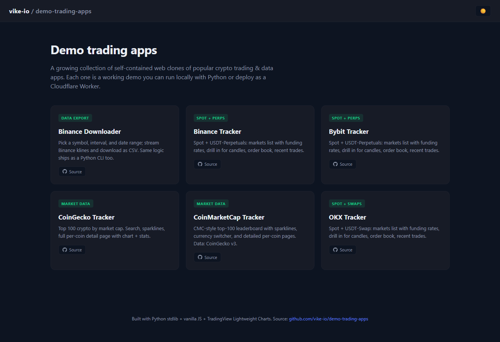
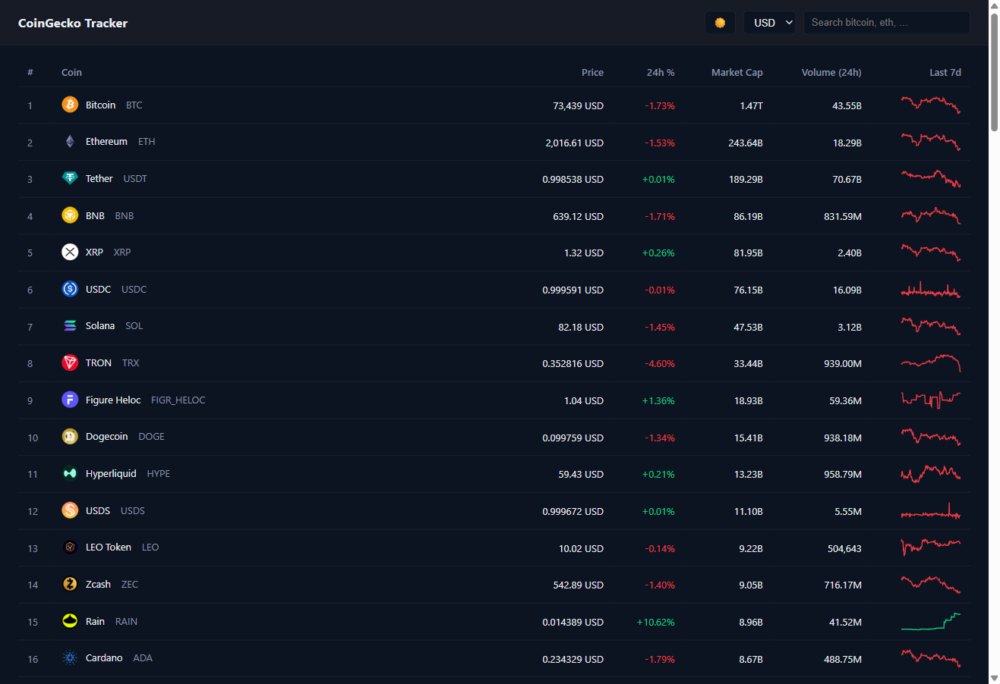
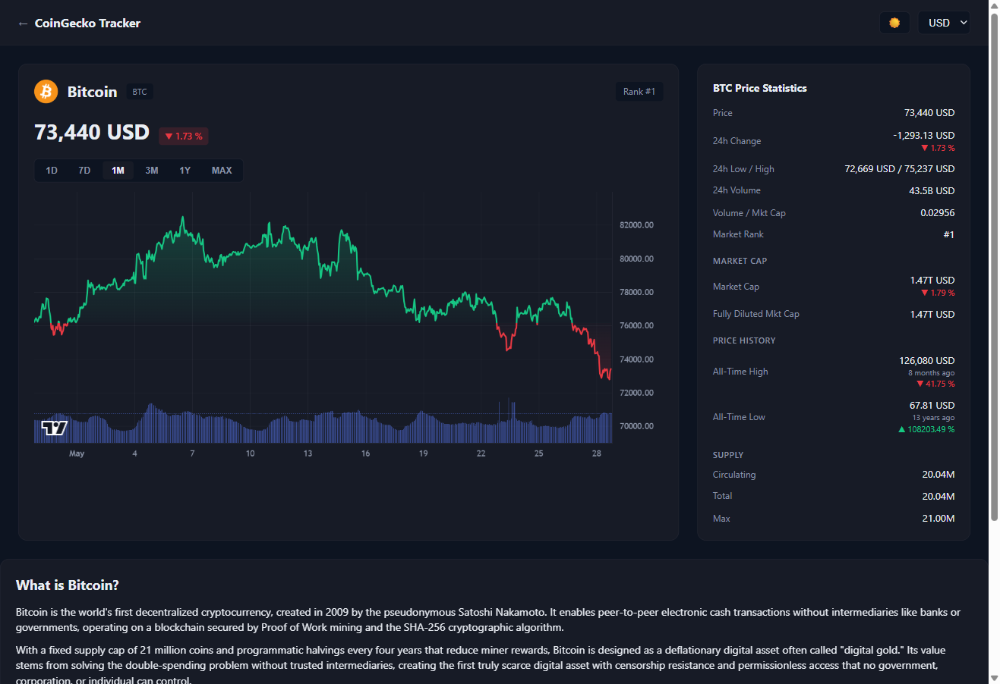
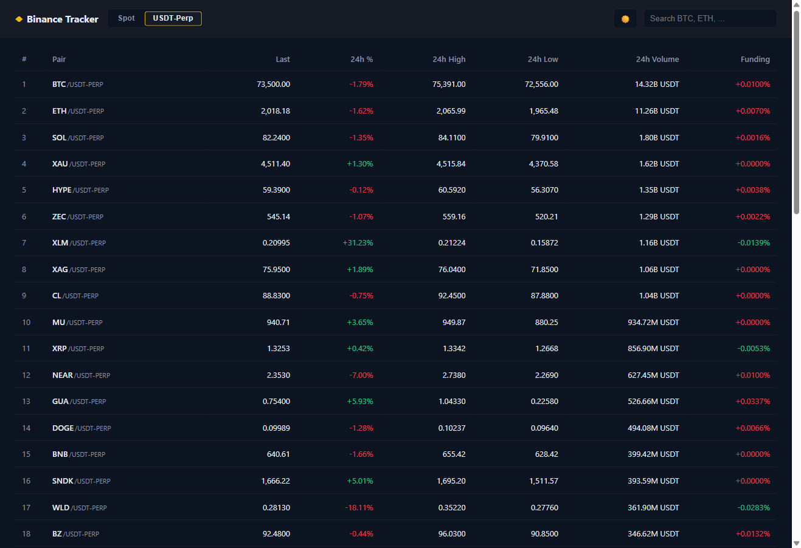
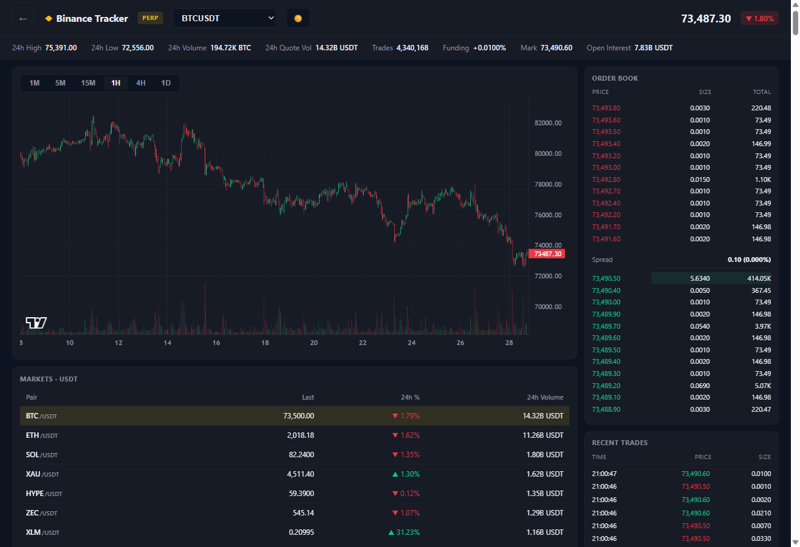
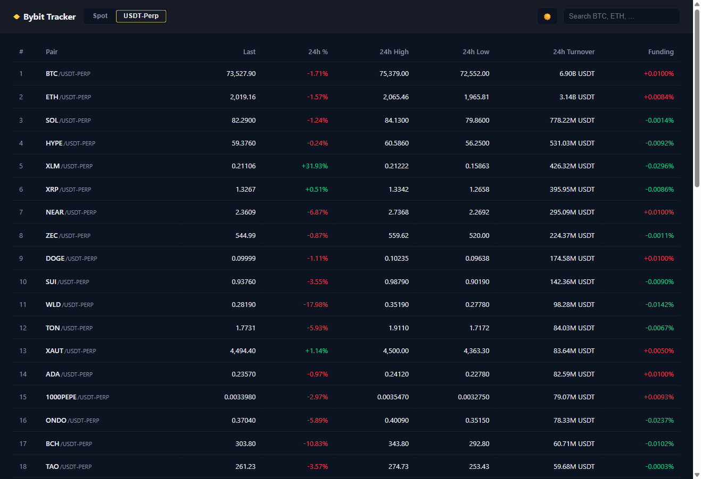
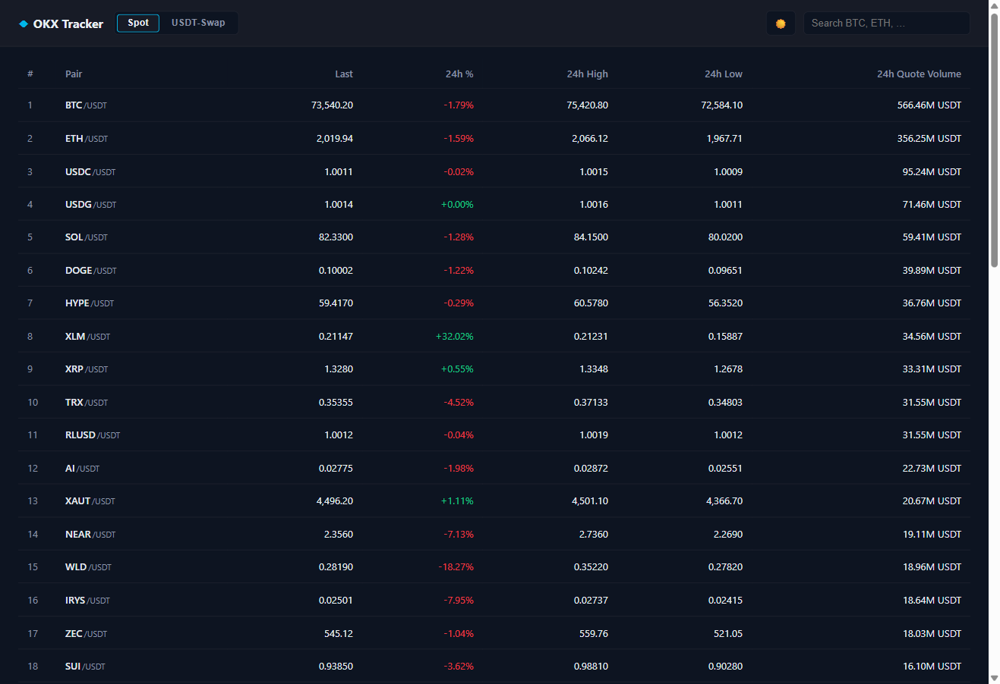
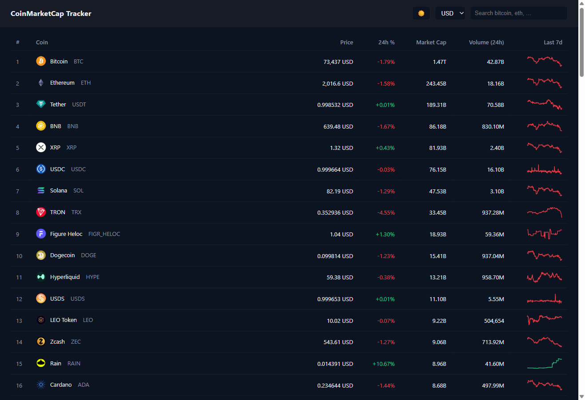
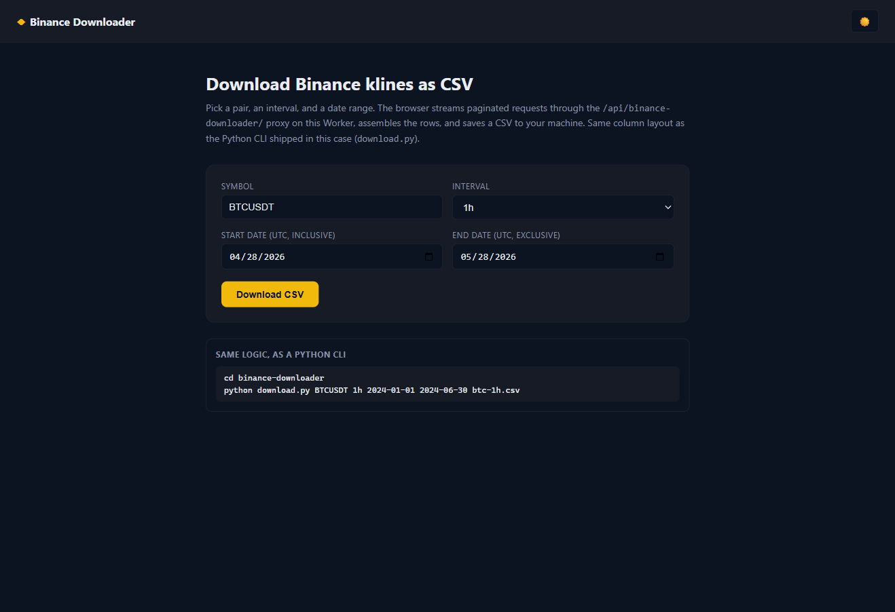
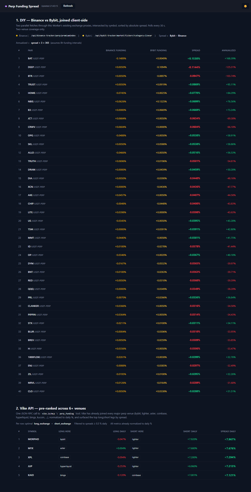

# demo-trading-apps

A collection of self-contained, web-based clones of popular crypto trading & data apps.
One umbrella monorepo, one Python build, one Cloudflare Worker, one URL.

[](https://github.com/vike-io/demo-trading-apps/actions/workflows/deploy.yml)
[](#license)
[](https://demo.vike.io/)

**Live:** [demo.vike.io](https://demo.vike.io/)

## Screenshots

### Landing — the showcase

[](https://demo.vike.io/)

> Each card on the landing links to a working case (left-click) or its source folder (bottom-right "Source" chip).

### CoinGecko Tracker — list + per-coin detail page

| Markets table | Per-coin detail page |
|---|---|
| [](https://demo.vike.io/coingecko-tracker/) | [](https://demo.vike.io/coingecko-tracker/coin?id=bitcoin) |

Top-100 by market cap with sparklines, currency switcher, search filter. Click any coin for a CMC-style detail page: TradingView Lightweight Charts baseline split, full stats panel, "What is X?" description, category chips, social/source links.

### Binance Tracker — Spot + USDT-Perpetuals

| Spot markets list | Perp trading view (BTCUSDT) |
|---|---|
| [](https://demo.vike.io/binance-tracker/) | [](https://demo.vike.io/binance-tracker/trade.html?symbol=BTCUSDT&mode=perp) |

CMC-style markets list with a SPOT / USDT-Perp toggle (funding column appears in perp mode). Row click opens the trade view with candle chart, depth-bar order book, recent trades, and a perp-stats ribbon (funding rate, mark price, open interest) when in perp mode.

### Bybit Tracker — Spot + USDT-Perpetuals

[](https://demo.vike.io/bybit-tracker/)

Same two-page pattern, Bybit yellow accent. Funding column on the listing for perp mode; trade view shows live funding-rate countdown and open interest.

### OKX Tracker — Spot + USDT-Swap

[](https://demo.vike.io/okx-tracker/)

OKX hyphenated instIds (BTC-USDT for spot, BTC-USDT-SWAP for swap). The trade view fans out three /public/* calls (mark-price, funding-rate, open-interest) in parallel when in swap mode.

### CoinMarketCap Tracker — CMC-style list + detail

[](https://demo.vike.io/coinmarketcap-tracker/)

Mirrors the CoinGecko Tracker shape but with CMC blue accent. Demonstrates the same data routed independently under two case brands.

### Binance Downloader — browser CSV + Python CLI

[](https://demo.vike.io/binance-downloader/)

A non-tracker case that plugs into the same umbrella. The browser version streams paginated klines via the `/api/binance-downloader/` Worker proxy and downloads a CSV via Blob. The same CSV schema ships as a Python CLI (`download.py`) that runs locally with stdlib only.

### Perp Funding Spread — DIY vs Vike API, side by side

[](https://demo.vike.io/perp-funding-spread/)

Two implementations of cross-exchange funding-rate dispersion stacked on one page. **Section 1 (DIY)** joins Binance perp `premiumIndex` with Bybit linear tickers via the existing exchange proxies — two-venue coverage, you write the math. **Section 2 (Vike API)** POSTs one JSON-RPC `tools/call` to `vike.io/mcp` through this Worker (which attaches the `X-API-KEY` from a secret) and gets the top spreads across 6+ venues pre-ranked, normalised to daily %, with optimal long/short legs already chosen. The contrast is the point.

## Cases

| Case | Demo | Data source | Status |
|---|---|---|---|
| [`coingecko-tracker/`](./coingecko-tracker/) | [demo.vike.io/coingecko-tracker/](https://demo.vike.io/coingecko-tracker/) | CoinGecko v3 (`x-cg-demo-api-key`) | ✅ live |
| [`coinmarketcap-tracker/`](./coinmarketcap-tracker/) | [demo.vike.io/coinmarketcap-tracker/](https://demo.vike.io/coinmarketcap-tracker/) | CoinGecko v3 (CMC-styled) | ✅ live |
| [`binance-tracker/`](./binance-tracker/) | [demo.vike.io/binance-tracker/](https://demo.vike.io/binance-tracker/) | Binance Spot v3 + Futures v1 | ✅ live |
| [`bybit-tracker/`](./bybit-tracker/) | [demo.vike.io/bybit-tracker/](https://demo.vike.io/bybit-tracker/) | Bybit v5 (spot + linear) | ✅ live |
| [`okx-tracker/`](./okx-tracker/) | [demo.vike.io/okx-tracker/](https://demo.vike.io/okx-tracker/) | OKX v5 (spot + swap) | ✅ live |
| [`binance-downloader/`](./binance-downloader/) | [demo.vike.io/binance-downloader/](https://demo.vike.io/binance-downloader/) | Binance v3 | ✅ live |
| [`perp-funding-spread/`](./perp-funding-spread/) | [demo.vike.io/perp-funding-spread/](https://demo.vike.io/perp-funding-spread/) | DIY: Binance + Bybit perps · Vike: `vike.io/mcp` (`X-API-KEY`) | ✅ live |

## Architecture

```
demo-trading-apps/
├── build.py                     # orchestrator: discovers cases, renders, writes .dist/
├── serve.py                     # local proxy: serves .dist/, proxies /api/<slug>/*
├── worker.js + wrangler.jsonc   # Cloudflare Worker: same routing in production
├── .env                         # all API keys (gitignored)
│
├── landing/templates/index.html # showcase landing page
├── coingecko-tracker/
│   ├── manifest.json            # { slug, name, config, upstream_base, api_key_env, ... }
│   └── templates/{index,coin}.html
├── binance-tracker/
│   ├── manifest.json            # declares upstreams: { spot: {base}, perp: {base} }
│   └── templates/{index,trade}.html
├── bybit-tracker/               # similar 2-page shape
├── coinmarketcap-tracker/
├── okx-tracker/
├── binance-downloader/
│   ├── manifest.json
│   ├── templates/index.html     # browser CSV downloader
│   └── download.py              # local Python CLI, stdlib only
│
├── .github/workflows/deploy.yml # GH Actions: tests + build + wrangler deploy
└── .dist/                       # build output (gitignored, served to browsers)
```

**Add a new case** = drop a folder with `manifest.json` + `templates/`. The orchestrator finds it, the Worker routes `/api/<slug>/*` automatically, the landing card appears.

## URL routing (local & production)

| Request | Resolves to |
|---|---|
| `GET /` | landing |
| `GET /<slug>/` | case home (e.g. `binance-tracker`) |
| `GET /<slug>/<page>.html` | other pages declared in the manifest (e.g. `trade.html`, `coin.html`) |
| `GET /api/<slug>/<path>` | proxied to that case's `upstream_base` + `<path>`, with optional auth header |
| `GET /api/<slug>/<mode>/<path>` | for cases that declare multiple `upstreams`, the first path segment selects the host |

## Run locally

```bash
python build.py
python serve.py        # http://localhost:8000
```

No `pip install` — stdlib only. To use the CoinGecko demo tier, drop `COINGECKO_API_KEY=...` into `.env`. Binance, Bybit, OKX work keyless.

## Deploy

Deployment is automatic on push to `main` via GitHub Actions ([`.github/workflows/deploy.yml`](.github/workflows/deploy.yml)). Required repo secrets:

- `CLOUDFLARE_API_TOKEN` — token with **Workers Scripts: Edit** + **Workers R2 Storage: Edit** + **Account Settings: Read**
- `CLOUDFLARE_ACCOUNT_ID`

To deploy manually:

```bash
python build.py
wrangler secret put COINGECKO_API_KEY   # one-time, per Worker
wrangler deploy
```

## Tech choices

- **Python stdlib** — no `pip install` for the build or local server.
- **Vanilla JS + Fetch** in the browser — no framework, no bundler.
- **TradingView Lightweight Charts** (CDN, ~80 KB) for all candle / line / volume charts.
- **Cloudflare Workers + Static Assets** — single Worker handles routing + proxy + static delivery.
- **Dark theme by default**, light theme toggle, persisted to `localStorage`.

## License

MIT.
